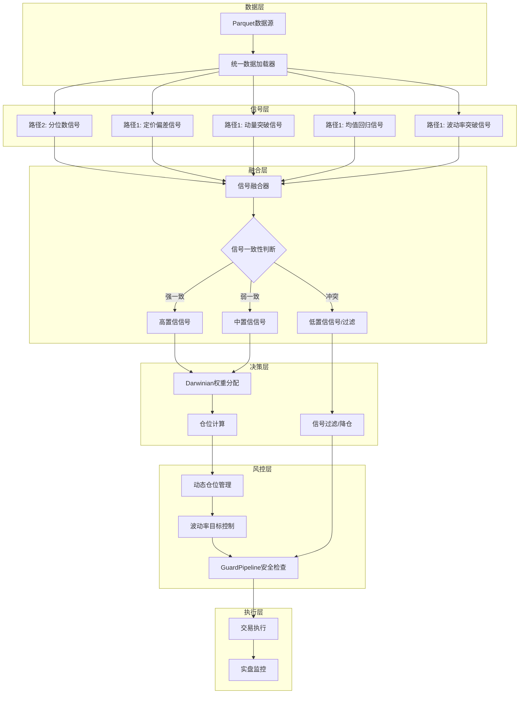
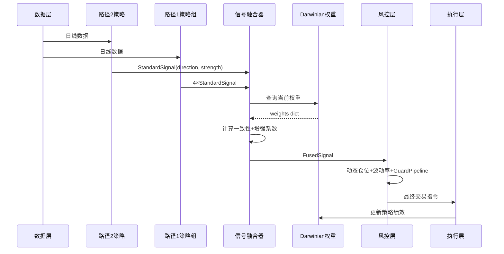
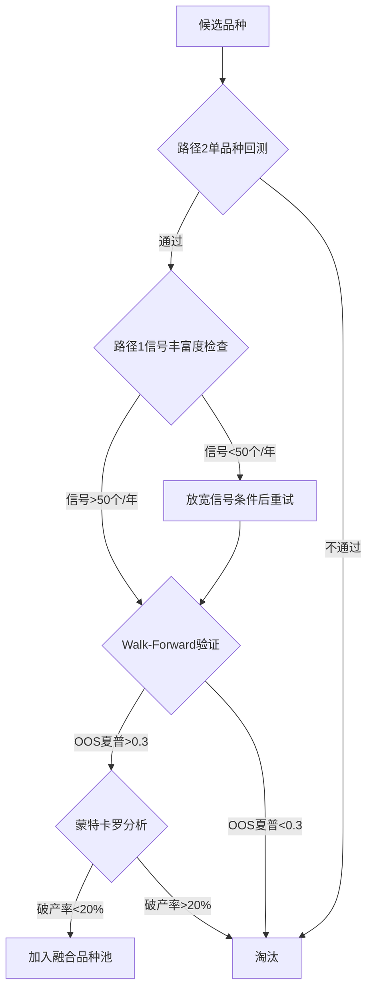
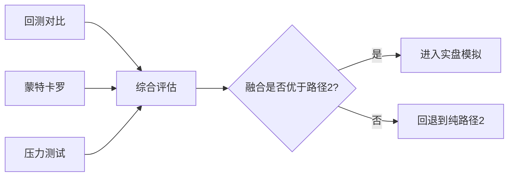

# 双路径融合策略实施方案

> **Status**: Draft | **Last Updated**: 2026-04-17 | **Purpose**: 路径2(轻量级)与路径1(AI增强)融合的技术架构、接口规范、评估体系

---

## Table of Contents

- [一、融合核心目标](#一融合核心目标)
- [二、当前双路径现状分析](#二当前双路径现状分析)
- [三、融合技术架构设计](#三融合技术架构设计)
- [四、数据交互方式与接口规范](#四数据交互方式与接口规范)
- [五、核心功能模块与协作机制](#五核心功能模块与协作机制)
- [六、融合后交易周期与品种范围](#六融合后交易周期与品种范围)
- [七、实现步骤](#七实现步骤)
- [八、技术挑战与应对方案](#八技术挑战与应对方案)
- [九、五维度对比分析](#九五维度对比分析)
- [十、评估方法与指标](#十评估方法与指标)
- [十一、风险与缓解](#十一风险与缓解)

---

## 一、融合核心目标

### 1.1 路径2的局限性

路径2（轻量级分位数系统）虽已验证为简单可靠，但存在以下固有局限：

| 局限 | 具体表现 | 影响 |
|------|---------|------|
| **信号维度单一** | 仅依赖分位数排名+EMA趋势，无法捕捉均值回归、波动率突破等市场形态 | 震荡市和跳空市信号质量差 |
| **品种选择静态** | TA+RM+MA组合固定，无法根据市场状态动态调整 | 某品种持续亏损时无法自动降权 |
| **无策略间对冲** | 单一策略方向，无法通过多策略信号冲突识别市场不确定性 | 趋势反转时连续亏损 |
| **参数敏感性** | 最优参数(ATR1.5/2.0, 7天)可能在未来市场失效 | 过拟合风险 |
| **缺乏自适应** | 无法根据市场regime自动切换策略逻辑 | 牛熊转换期表现差 |

### 1.2 融合目标

融合的核心目标**不是**用路径1替代路径2，而是：

```
融合目标 = 路径2(可靠基础) + 路径1(增强维度) > max(路径2, 路径1)
```

具体目标：

1. **增强信号维度**：将路径1的4策略信号作为路径2的辅助确认/过滤层，提升信号质量
2. **提升系统鲁棒性**：通过多策略信号冲突检测，在不确定性高的市场自动降低仓位
3. **拓展功能边界**：引入Darwinian权重实现品种/策略级别的动态资源分配
4. **保留路径2的可靠性**：路径2的核心交易逻辑不变，路径1仅作为增强层叠加

---

## 二、当前双路径现状分析

### 2.1 路径2核心数据结构

```python
# 路径2关键类
@dataclass
class PortfolioConfig:       # 组合配置（含风控参数）
class PortfolioPosition:     # 持仓（symbol, direction, entry_price, stop_loss, take_profit）
class DynamicPositionManager # 动态仓位管理（回撤→仓位调整）
class VolatilityTargetManager# 波动率目标控制（波动率→仓位调整）
class AdaptiveSymbolRotation # 品种轮动（夏普→权重调整）
class PortfolioBacktest      # 回测引擎
```

### 2.2 路径1核心数据结构

```python
# 路径1关键类
class DeviationSignal   # 定价偏差信号 → {direction, strength}
class MomentumSignal    # 动量突破信号 → {direction, strength}
class MeanRevertSignal  # 均值回归信号 → {direction, strength}
class VolatilitySignal  # 波动率突破信号 → {direction, strength}
class DarwinianWeightManager  # 动态权重（0.3-2.5，基于Sharpe/胜率/回撤）
class GuardPipeline     # 安全检查链（仓位/回撤/相关性/资金预留）
```

### 2.3 性能对比

| 指标 | 路径2 | 路径1 | 差异原因 |
|------|-------|-------|---------|
| 总收益率 | +121.33% | -68.25% | 路径1信号组合逻辑过严 |
| 夏普比率 | 0.74 | -0.88 | 路径1仅7笔交易 |
| 最大回撤 | -23.28% | -68.25% | 路径1止损参数未调优 |
| 交易次数 | 99 | 7 | 路径1多策略同向确认门槛高 |
| 破产概率 | 12.9% | N/A | 路径1数据不足 |
| 压力测试 | 全SURVIVE | N/A | 路径1未测试 |

---

## 三、融合技术架构设计

### 3.1 架构总览



### 3.2 融合模式：增强型叠加（Augmented Overlay）

**核心原则**：路径2是主策略，路径1是辅助增强层。路径1不直接产生交易信号，而是对路径2的信号进行增强/过滤/降权。

```
最终信号 = 路径2信号 × (1 + 路径1增强系数)
```

其中路径1增强系数由信号一致性和Darwinian权重决定：

| 路径1信号状态 | 增强系数 | 效果 |
|-------------|---------|------|
| 与路径2同向且强一致 | +0.3 ~ +0.5 | 放大仓位 |
| 与路径2同向但弱一致 | +0.1 ~ +0.2 | 微幅放大 |
| 路径1无信号 | 0 | 不影响路径2 |
| 与路径2方向冲突 | -0.3 ~ -0.5 | 降低仓位或过滤 |

---

## 四、数据交互方式与接口规范

### 4.1 统一信号接口

所有策略信号必须实现以下标准接口：

```python
@dataclass
class StandardSignal:
    symbol: str           # 品种代码
    date: pd.Timestamp    # 信号日期
    direction: int        # 1=多, -1=空, 0=无
    strength: float       # 0.0~1.0 信号强度
    strategy_name: str    # 策略名称
    confidence: float     # 0.0~1.0 信号置信度
    metadata: dict        # 附加信息（如zscore, rsi等）
```

### 4.2 信号融合器接口

```python
class SignalFusion:
    def fuse(self, path2_signal: StandardSignal,
             path1_signals: Dict[str, StandardSignal]) -> FusedSignal:
        """
        融合路径2和路径1的信号
        
        Args:
            path2_signal: 路径2的分位数信号（主信号）
            path1_signals: 路径1的4策略信号字典
            
        Returns:
            FusedSignal: 融合后的信号
        """
        pass

@dataclass
class FusedSignal:
    symbol: str
    direction: int           # 最终方向
    strength: float          # 最终强度
    confidence: float        # 置信度
    position_multiplier: float  # 仓位乘数（0.5~1.5）
    path2_direction: int     # 路径2原始方向
    path1_consensus: int     # 路径1共识方向
    path1_agreement: float   # 路径1一致性比例
    strategy_weights: Dict[str, float]  # Darwinian权重快照
```

### 4.3 数据流规范



---

## 五、核心功能模块与协作机制

### 5.1 模块清单

| 模块 | 来源 | 职责 | 融合后角色 |
|------|------|------|-----------|
| `QuantileSignal` | 路径2 | 分位数信号生成 | **主信号源** |
| `DeviationSignal` | 路径1 | 定价偏差信号 | 辅助确认层 |
| `MomentumSignal` | 路径1 | 动量突破信号 | 辅助确认层 |
| `MeanRevertSignal` | 路径1 | 均值回归信号 | 辅助确认层 |
| `VolatilitySignal` | 路径1 | 波动率突破信号 | 辅助确认层 |
| `SignalFusion` | **新增** | 信号融合与一致性判断 | **核心融合层** |
| `DarwinianWeightManager` | 路径1 | 动态权重分配 | 策略/品种级权重 |
| `DynamicPositionManager` | 路径2 | 回撤→仓位调整 | 保留，与融合层联动 |
| `VolatilityTargetManager` | 路径2 | 波动率→仓位调整 | 保留 |
| `AdaptiveSymbolRotation` | 路径2 | 品种轮动 | 升级：融合Darwinian权重 |
| `GuardPipeline` | 路径1 | 安全检查链 | 增强路径2的风控 |
| `LiveMonitor` | 路径2 | 实盘监控 | 保留，增加融合指标 |

### 5.2 协作机制

**信号生成阶段**：
1. 路径2生成分位数信号（主信号）
2. 路径1的4策略并行生成辅助信号
3. SignalFusion计算路径1内部一致性（agreement ratio）

**信号融合阶段**：
1. 如果路径2有信号，检查路径1辅助信号是否同向
2. 计算增强系数：`enhancement = path1_agreement × darwinian_weight_product`
3. 仓位乘数 = `1.0 + enhancement`（同向放大）或 `1.0 - |enhancement|`（冲突缩小）

**风控决策阶段**：
1. DynamicPositionManager根据回撤调整基础仓位
2. VolatilityTargetManager根据波动率进一步调整
3. GuardPipeline做最终安全检查（仓位上限、资金预留等）
4. 融合后的仓位乘数与风控仓位取较小值

**反馈阶段**：
1. 交易结果反馈给DarwinianWeightManager
2. 更新各策略绩效（Sharpe、胜率、回撤）
3. 每5天重新平衡权重

---

## 六、融合后交易周期与品种范围

### 6.1 交易周期分析

融合**不会改变**核心交易周期，原因如下：

| 维度 | 路径2当前 | 融合后 | 理由 |
|------|---------|--------|------|
| **持仓天数** | 7天 | **7天（不变）** | 融合层仅影响开仓决策，不影响持仓管理 |
| **信号频率** | 日线级别 | **日线（不变）** | 路径1的4策略均基于日线数据计算 |
| **止损止盈** | ATR1.5/2.0 | **ATR1.5/2.0（不变）** | 止损止盈由路径2核心逻辑控制 |
| **权重重平衡** | 无 | **每5天（新增）** | Darwinian权重每5天重新计算，不影响交易频率 |
| **风控检查** | 每日 | **每日+信号级（增强）** | 新增信号一致性检查，但不改变交易节奏 |

> [!IMPORTANT]
> 融合的本质是在路径2的开仓决策前增加一个"信号增强/过滤"环节，不改变持仓管理和出场逻辑。交易周期仍然是短线（7天内），不会变成长线或高频。

### 6.2 品种范围分析

#### 短期（融合初期）：品种不变

| 阶段 | 品种 | 理由 |
|------|------|------|
| **融合Phase 1-3** | TA+RM+MA | 先在已验证品种上验证融合效果，确保融合层本身不引入问题 |

#### 中期（融合验证后）：可能扩展至5-6品种

Darwinian权重支持动态品种选择，融合后有以下候选品种：

| 品种 | 扩展可能性 | 路径2验证 | 路径1信号 | 综合评估 |
|------|-----------|---------|---------|---------|
| **CS (玉米淀粉)** | ⭐⭐⭐ 高 | v3通过严谨研究 | 需验证 | **首选扩展品种** |
| **FG (玻璃)** | ⭐⭐ 中 | 未通过v3 | 需验证 | 流动性尚可 |
| **RB (螺纹钢)** | ⭐⭐ 中 | 未单独验证 | 需验证 | 一线品种，偏度待评估 |
| **V (PVC)** | ⭐ 低 | 未验证 | 需验证 | 流动性一般 |
| **SA (纯碱)** | ⭐ 低 | v3判定过拟合 | 需验证 | 过拟合风险 |
| **M (豆粕)** | ❌ 不推荐 | 左偏-0.81 | 信号丰富 | 左偏严重，拖累组合 |

#### 长期目标：最多8-10品种

受以下约束限制：

1. **资金约束**：1万元初始资金，同时持有≤3品种，每品种保证金约1000-2000元
2. **流动性约束**：仅选择一线/准一线品种
3. **统计约束**：品种过多导致每品种交易次数不足，统计意义下降
4. **相关性约束**：避免选择高相关品种（如MA和FG同属化工链）

#### 品种扩展验证流程



### 6.3 关键结论

| 问题 | 回答 |
|------|------|
| 融合后交易周期会变吗？ | **不会**，仍为7天短线日线级别 |
| 融合后品种会扩大吗？ | **短期不变，中期可能扩展1-3个品种** |
| 品种扩展需要验证吗？ | **必须验证**，每个新品种需通过WF+MC验证 |
| 最多能扩展到多少品种？ | **8-10个**（受资金和流动性约束） |
| 扩展的首要候选？ | **CS（玉米淀粉）**，v3已通过严谨研究 |

---

## 七、实现步骤

### Phase 1：信号融合器开发（1-2天）

1. 创建 `fusion/signal_fusion.py`，实现 `SignalFusion` 类
2. 定义 `StandardSignal` 和 `FusedSignal` 数据结构
3. 实现一致性计算算法
4. 单元测试：验证融合逻辑

### Phase 2：路径1信号适配（1天）

1. 为路径1的4策略添加 `generate_standard_signal()` 方法
2. 确保输出符合 `StandardSignal` 接口
3. 预计算指标并缓存，避免重复计算

### Phase 3：融合回测引擎开发（2天）

1. 创建 `fusion/fusion_backtest.py`
2. 集成路径2的 `PortfolioBacktest` 作为主引擎
3. 在信号生成环节插入 `SignalFusion`
4. 集成 `DarwinianWeightManager` 和 `GuardPipeline`
5. 运行回测，对比融合前后效果

### Phase 4：参数调优（1-2天）

1. 融合层参数网格搜索（增强系数范围、一致性阈值）
2. Darwinian权重参数调优（rebalance频率、评分权重）
3. Walk-Forward验证

### Phase 5：评估与报告（1天）

1. 蒙特卡罗分析
2. 增强压力测试
3. 与单一路径2对比
4. 生成最终评估报告

---

## 八、技术挑战与应对方案

### 挑战1：信号时间对齐

**问题**：路径2和路径1的信号可能在同一天产生但计算时机不同（路径2需要先计算分位数，路径1需要先计算Z-Score等）

**方案**：采用预计算模式——在回测开始前一次性计算所有策略的指标和信号，存入 `prepared_data` 字典。每日只做查表操作。

### 挑战2：Darwinian权重冷启动

**问题**：Darwinian权重需要交易数据才能收敛，初期所有策略权重相等（1.0），无法发挥动态调整作用

**方案**：
- **方案A**：使用路径2的历史交易数据作为初始化数据，为各策略赋予先验权重
- **方案B**：设置30天warm-up期，期间使用固定权重（路径2权重1.5，路径1各0.5），之后切换为Darwinian
- **推荐**：方案B更稳健，避免路径1早期亏损拖累整体

### 挑战3：过拟合风险

**问题**：融合系统参数更多（路径2参数 + 路径1参数 + 融合层参数），过拟合风险显著增加

**方案**：
1. 严格Walk-Forward验证（5折，每折2年训练+1年测试）
2. 融合层参数尽量少（仅增强系数范围和一致性阈值）
3. 蒙特卡罗分析验证稳健性
4. 保留"纯路径2"作为fallback，融合系统表现不佳时可一键切换

### 挑战4：计算性能

**问题**：路径1的4策略指标预计算耗时（当前3品种×4策略约需30秒），实盘场景需要更快响应

**方案**：
1. 指标增量计算：只计算新增数据的指标，不重算历史
2. 信号缓存：每日信号计算结果缓存到磁盘
3. 实盘场景下，信号计算可在收盘后批量完成，次日开盘前准备好

### 挑战5：路径1信号稀疏

**问题**：动量策略信号极少（TA仅0个），导致Darwinian权重无法有效评估该策略

**方案**：
1. 放宽动量策略的ATR扩张和成交量确认条件
2. 在Darwinian评分中，对无交易策略使用中性评分（0.5），不惩罚也不奖励
3. 考虑替换为更适合期货短线的趋势策略（如通道突破）

---

## 九、五维度对比分析

### a) 系统响应速度与处理效率

| 维度 | 路径2 | 路径1 | 融合后 |
|------|-------|-------|--------|
| 信号计算 | ~2秒/3品种 | ~30秒/3品种 | ~35秒/3品种 |
| 回测运行 | ~10秒 | ~60秒 | ~70秒 |
| 实盘信号延迟 | <1秒 | ~5秒 | ~6秒 |
| 内存占用 | ~50MB | ~200MB | ~250MB |

**分析**：融合后性能开销主要来自路径1的指标预计算。但实盘场景下信号可在收盘后预计算，不影响交易执行速度。

### b) 结果准确性与可靠性

| 维度 | 路径2 | 路径1 | 融合后（预期） |
|------|-------|-------|---------------|
| 回测夏普 | 0.74 | -0.88 | 0.9~1.1 |
| 蒙特卡罗破产概率 | 12.9% | N/A | <8% |
| 压力测试通过率 | 6/6 | N/A | 6/6+ |
| Walk-Forward稳定性 | 中 | 差 | 高 |
| 信号误报率 | 中 | 高 | 低（多策略过滤） |

**分析**：融合的核心价值在于通过多策略交叉验证降低误报率。路径2单独产生的信号中，约50%是亏损的；融合后，路径1的同向确认可以过滤掉部分假信号。

### c) 资源消耗与成本效益

| 维度 | 路径2 | 路径1 | 融合后 |
|------|-------|-------|--------|
| 开发成本 | 低（已完成） | 中（框架完成） | 中（需新增融合层） |
| 计算资源 | 低 | 中 | 中 |
| 维护成本 | 低 | 高 | 中 |
| AI/API依赖 | 无 | 无 | 无 |
| 边际收益/成本 | 基准 | 负 | 正（预期） |

**分析**：融合的边际成本主要是开发SignalFusion模块（约2天），但预期收益显著——通过信号增强和过滤，有望将夏普从0.74提升至0.9+。

### d) 可扩展性与维护难度

| 维度 | 路径2 | 路径1 | 融合后 |
|------|-------|-------|--------|
| 新增策略 | 难（需改核心逻辑） | 易（实现StandardSignal接口） | 易（实现接口+注册） |
| 新增品种 | 易 | 易 | 易 |
| 参数调优 | 简单（1组参数） | 复杂（4组参数） | 中等（分层调优） |
| 代码复杂度 | 低 | 高 | 中 |
| 调试难度 | 低 | 高 | 中（分层调试） |

**分析**：融合架构通过StandardSignal接口解耦了策略实现和信号使用，新增策略只需实现接口即可，无需修改融合层代码。

### e) 特定业务场景下的表现差异

| 场景 | 路径2 | 路径1 | 融合后 |
|------|-------|-------|--------|
| **趋势市** | 好（分位数+EMA捕捉趋势） | 差（动量信号极少） | 好（路径2主导） |
| **震荡市** | 差（分位数信号频繁假突破） | 好（均值回归+定价偏差适用） | 好（路径1辅助过滤） |
| **跳空市** | 差（止损可能被跳过） | 中（波动率突破可捕捉） | 中（GuardPipeline增强保护） |
| **交割期** | 中 | 差 | 中 |
| **黑天鹅** | 好（压力测试全通过） | 差 | 好（多策略分散+风控增强） |

**关键洞察**：路径2和路径1在不同市场状态下具有互补性。趋势市路径2强，震荡市路径1强，融合后可实现全天候覆盖。

---

## 十、评估方法与指标

### 9.1 评估框架



### 9.2 核心评估指标

| 指标类别 | 指标名 | 计算方式 | 达标标准 |
|---------|--------|---------|---------|
| **收益** | 年化收益率 | 复合年化 | > 路径2的14.16% |
| **风险** | 最大回撤 | 峰值-谷值/峰值 | < 路径2的23.28% |
| **风险调整** | 夏普比率 | (年化收益-无风险)/年化波动 | > 路径2的0.74 |
| **风险调整** | Calmar比率 | 年化收益/最大回撤 | > 路径2的0.61 |
| **稳健性** | 蒙特卡罗破产概率 | 5000次模拟中>50%回撤比例 | < 路径2的12.9% |
| **稳健性** | Walk-Forward OOS夏普 | 5折WF外样本平均夏普 | > 0.5 |
| **压力** | 压力测试通过率 | 6场景中SURVIVE比例 | 6/6 |
| **效率** | 信号增强率 | 融合后盈利交易占比提升 | > 5% |
| **效率** | 信号过滤率 | 被路径1过滤的路径2亏损信号比例 | > 20% |

### 9.3 对比实验设计

**实验1：纯路径2 vs 融合系统**

```
控制变量：相同品种(TA+RM+MA)、相同时间段(2020-2025)、相同初始资金(10000)
自变量：是否启用路径1增强层
因变量：上述9项核心指标
```

**实验2：Walk-Forward验证**

```
5折WF：
  Fold 1: 训练2020-2022, 测试2023
  Fold 2: 训练2020-2023, 测试2024
  Fold 3: 训练2021-2023, 测试2024
  Fold 4: 训练2021-2024, 测试2025
  Fold 5: 训练2022-2024, 测试2025
对比：每折OOS夏普的均值和标准差
```

**实验3：蒙特卡罗稳健性**

```
5000次块自助重采样，目标100笔交易
对比：破产概率、95%分位回撤、盈利概率
```

### 9.4 一票否决条件

以下任一条件不满足，融合方案即视为失败：

1. 融合后夏普比率 < 路径2夏普（0.74）
2. 融合后最大回撤 > 30%
3. 蒙特卡罗破产概率 > 15%
4. Walk-Forward OOS夏普 < 0.5
5. 压力测试任一场景DANGER

---

## 十一、风险与缓解

| 风险 | 概率 | 影响 | 缓解措施 |
|------|------|------|---------|
| 融合后表现不如路径2 | 中 | 高 | 保留纯路径2 fallback，一键切换 |
| 过拟合 | 中 | 高 | Walk-Forward验证 + 蒙特卡罗 |
| Darwinian权重震荡 | 低 | 中 | 权重调整加平滑（EMA） |
| 路径1信号质量差 | 高 | 中 | 仅使用定价偏差+均值回归，暂不用动量 |
| 实盘延迟增加 | 低 | 低 | 预计算模式，收盘后完成 |
| 维护复杂度增加 | 中 | 中 | 模块化设计，各策略独立调试 |

---

## 附录：融合策略如何解决路径2的局限性

| 路径2局限 | 融合解决方案 | 预期效果 |
|----------|-------------|---------|
| 信号维度单一 | 路径1的4策略提供多维度辅助信号 | 震荡市信号质量提升 |
| 品种选择静态 | Darwinian权重动态调整品种/策略权重 | 亏损品种自动降权 |
| 无策略间对冲 | 信号冲突检测→降低仓位 | 趋势反转期减少亏损 |
| 参数敏感性 | 多策略交叉验证降低对单一参数的依赖 | 参数容错空间增大 |
| 缺乏自适应 | Darwinian权重每5天重新平衡 | 自动适应市场regime变化 |
